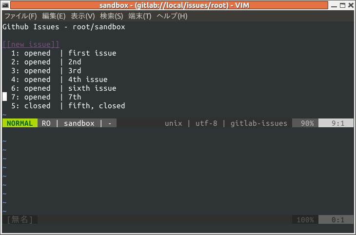
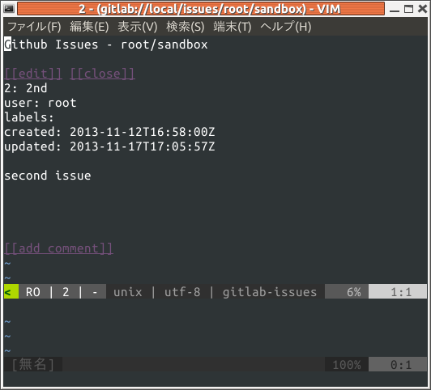
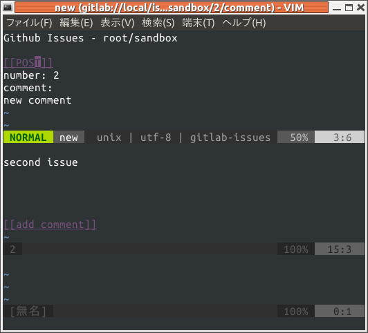
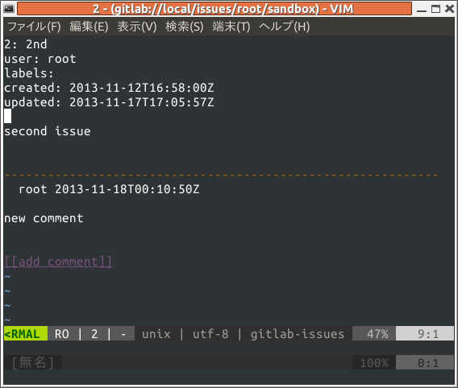

# vim-gitlab

vim-gitlab is a vim client for GitLab

* c.f. https://github.com/thinca/vim-github
* c.f. http://d.hatena.ne.jp/thinca/20100701/1277994373


GitLab を vim から参照・変更するプラグインです.
- 現状 issues のみに対応
- GitLab は 6-1-stable 以下でも動作しますが `issue #x` の数字と表示される数値が一致しません.
(API が対応していないため)
    - c.f. https://github.com/gitlabhq/gitlabhq/commit/02693b72a4240a9d94246e590775a66eb48c55ed
- thinca さんの vim-github を元にコピー＆修正で作成しています. 

# Install

```vim
NeoBundleLazy 'syngan/vim-gitlab', {
    \ 'autoload' : {
    \ 'commands' : 'Gitlab'}}
```

- required 
    - GitLab 6-2-stable
    - `+python` or `curl` or `wget` (`vital.vim` の `Web.HTTP` に依存)


# Config

以下のように変数 `g:gitlab_config` を定義します.
- `__name__` は任意に設定します.
- `url` はアクセスする GitLab の URL (必須)
    - e.g., https://hoge.com/apps/gitlab/
    - e.g., http://localhost:1192/
- `user`/`email` はログイン ID (必須)
- `password` はパスワード (任意)


```vim
g:gitlab_config['__name__'] = {
\	'url' : 'http://localhost/',
\	'user' : '',
\	'email' : 'admin@local.host',
\	'password' : 'optional',
\}
```
# Usage

下記のようにして, `g:gitlab_config` で定義した `__name__` にアクセスします.
`root/sandbox` はリポジトリ名.

```vim
:Gitlab __name__ issues root/sandbox
```

# Screenshot

## issues list


## show issue #2


## add comment


## show issues #2

